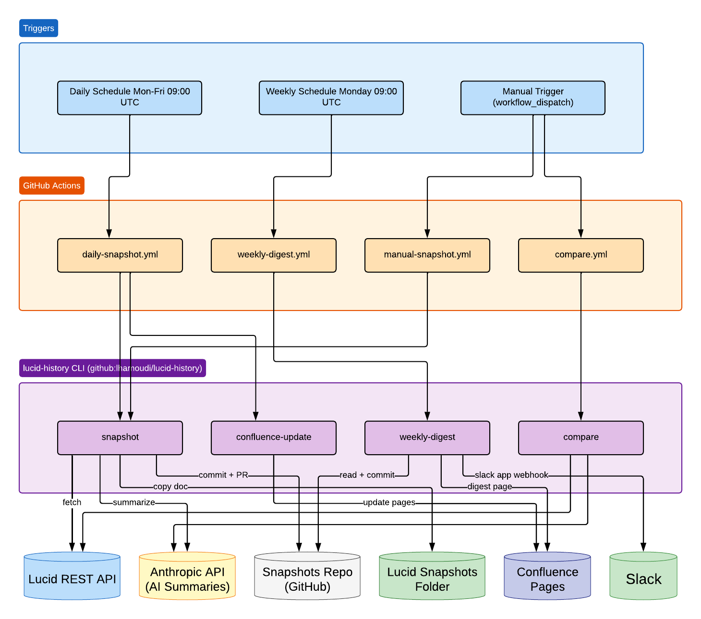

# lucid-history

Track Lucidchart changes over time. Each day, take a structural JSON snapshot of one or more Lucidchart documents, commit it to a private GitHub repo via an auto-merged PR whose body is an AI-generated summary of what changed since the last snapshot.

## How it works

```
Lucid REST API  →  fetch document JSON  →  normalize  →  semantic diff vs latest
                                                              ↓
                                                         non-empty?
                                                              ↓
                                          yes  ←  +  Anthropic summary
                                                              ↓
                                         commit {JSON, summary.md}
                                                              ↓
                                               open PR on snapshots repo
                                                              ↓
                            copy doc to Lucid __AUTOMATED_SNAPSHOTS folder
                                                              ↓
                                          squash-merge PR + delete branch
                                                              ↓
                                         update Confluence page (if configured)
```

The semantic diff keys shapes and lines by their stable Lucid IDs and reports: added/removed/renamed pages, added/removed/text-changed/class-changed shapes, and added/removed/rewired/label-changed lines. Layout coordinates are not in the source data at all, so pure "drag this block" edits produce no diff. Inconsequential metadata (e.g. sticky-note attribution text) is filtered before diffing.

## Architecture



## Lucid API limitations

Lucid's REST API exposes the current state of a document but [does not provide access to saved version history](https://community.lucid.co/developer-community-6/reterive-a-lucidchart-document-like-the-in-saved-versions-6968). There is no endpoint to retrieve a past snapshot or enumerate the versions you see in the Lucid UI. This tool exists to close that gap by taking periodic snapshots and persisting them in Git, giving you a diffable history that Lucid itself doesn't expose.

A second gap remains even with this approach: the API carries no authorship or fine-grained timestamp information per change. We can detect *what* changed between two snapshots, but we cannot attribute individual edits to a specific person or a precise time — only to the window between two snapshot runs.

## Prerequisites

- Node.js 20+ (tested on 22)
- Lucid API key — requires a Lucid plan that exposes the REST API (Team/Enterprise)
- Anthropic API key
- GitHub personal access token with `repo` scope for the private snapshots repo

Copy `.env.example` to `.env` and fill in your keys:

```bash
cp .env.example .env
```

## Install

```bash
git clone https://github.com/your-org/lucid-history.git
cd lucid-history
npm install
npm run build
```

## Commands

### `fetch` — pull a document and write its JSON

```bash
npx lucid-history fetch <doc-id> --out /tmp/doc.json
```

### `diff` — compare two committed snapshots

```bash
npx lucid-history diff path/to/base.json path/to/head.json
npx lucid-history diff path/to/base.json path/to/head.json --raw   # DocDiff JSON only, no AI
```

### `compare` — diff two live Lucid documents

```bash
npx lucid-history compare <base-doc-id> <head-doc-id>
npx lucid-history compare <base-doc-id> <head-doc-id> --raw          # DocDiff JSON only, no AI
npx lucid-history compare <base-doc-id> <head-doc-id> --out ./out    # write PNGs + summary to dir
npx lucid-history compare <base-doc-id> <head-doc-id> --skip-renders # skip PNG exports
```

Fetches both documents live and prints an AI-generated summary of structural differences. Useful when you restore an old version of a document in Lucid (which creates a new doc ID) and want to compare it against the current version. With `--out`, writes `summary.md` and per-page before/after PNGs into the specified directory.

### `snapshot` — full daily pipeline

```bash
npx lucid-history snapshot <doc-id> --repo your-org/your-snapshots-repo
npx lucid-history snapshot <doc-id> --repo your-org/your-snapshots-repo --dry-run
npx lucid-history snapshot <doc-id> --repo your-org/your-snapshots-repo --lucid-folder <folder-id>
```

`--dry-run` fetches, diffs, and prints the AI summary without writing any files, pushing any commits, or creating a Lucid copy.

`--lucid-folder <id>` copies the live document into a `<doc-title>` subfolder under the given Lucid folder (created on first use, reused after), titled `SNAPSHOT_<doc-title>_<YYYY-MM-DD> <HH:MM>`. A link is appended to both the snapshot `summary.md` and the PR body. The folder ID can be found in the Lucid URL (`folder_id=...`). Omit the flag to skip this step.

No prior snapshot? The first run creates an "initial snapshot" commit (JSON baseline, no diff summary).
No material changes since last snapshot? No commit, no PR — the command exits silently.

### `weekly-digest` — post a recap of the week's changes

```bash
# Slack only
npx lucid-history weekly-digest --repo your-org/your-snapshots-repo --slack-webhook <url>

# Write per-doc digest files to <doc>/digests/<YYYY-MM-DD>.md
npx lucid-history weekly-digest --repo your-org/your-snapshots-repo --write-digests

# Slack + Confluence + file (all optional, any combination)
npx lucid-history weekly-digest \
  --repo your-org/your-snapshots-repo \
  --slack-webhook <url> \
  --write-digests \
  --confluence-url https://your-org.atlassian.net \
  --confluence-email you@example.com \
  --confluence-token <atlassian-api-token> \
  --confluence-space MYSPACE

# Dry run (prints Markdown digest, no output)
npx lucid-history weekly-digest --repo your-org/your-snapshots-repo --dry-run
```

For each tracked document, finds the most recent snapshot **before** the week start (baseline) and the most recent snapshot **within** the week (head), diffs them, and generates a single AI summary of the net change. This means day-over-day churn that cancels out by Friday is invisible — only what's structurally different at the end of the week is reported. Skips silently if there are no changes that week.

`--week <YYYY-MM-DD>` targets the week containing the given date (default: current week). When run via GitHub Actions on Monday morning, the workflow passes last week's date automatically.

`--write-digests` writes per-doc Markdown files (committed to the snapshots repo as `<doc>/digests/<monday>.md`).

When Confluence flags are provided, each week's digest is published as a separate Confluence page (one per week, titled by the week label) under the specified parent.

Slack posts are labelled `🗓️ Weekly Digest` in the context line to distinguish them from `📸 Daily Snapshot` posts.

### `confluence-update` — publish snapshot history to Confluence

```bash
npx lucid-history confluence-update \
  --repo your-org/your-snapshots-repo \
  --confluence-url https://your-org.atlassian.net \
  --confluence-email you@example.com \
  --confluence-token <atlassian-api-token> \
  --confluence-space MYSPACE \
  --confluence-parent <parent-page-id>
```

Scans every doc folder under `snapshots/` in the local checkout, reads each doc's `HISTORY.md` and latest `summary.md`, and creates or updates a Confluence page per document under the specified parent. Pages are created on first run and updated in place on subsequent runs. Run automatically by `daily-snapshot.yml` when configured.

`--local <path>` sets the local snapshots repo path (default: `"."`). The Atlassian API token is generated at [id.atlassian.com/manage-profile/security/api-tokens](https://id.atlassian.com/manage-profile/security/api-tokens). The parent page ID can be found in the Confluence page URL (`?pageId=...` or `/wiki/spaces/KEY/pages/<id>`).

## Snapshots repo layout

The tool writes to the snapshots repo with this structure:

```
<doc-title>___<doc-id>/
  snapshots/
    latest.json                              copy of most recent snapshot
    HISTORY.md                               chronological table of all snapshots
    2026-04-22T10-30-00Z/
      snapshot.json                          full normalized document JSON
      summary.md                             the PR body, archived
  digests/
    2026-04-27.md                            per-doc weekly digest for that Monday's week
docs.json                                    list of tracked document IDs
```

Folder names use the convention `<human-readable-name>___<id>` so the identifier is always unambiguous. Both doc titles and page names are sanitized (`[^a-zA-Z0-9_-]` → `_`); IDs are appended verbatim after `___`.

## Setting up a snapshots repo

The [`templates/`](templates/) directory contains ready-to-use workflow files and a starter `docs.json` for bootstrapping a new snapshots repo:

```
templates/
  workflows/
    daily-snapshot.yml      scheduled Mon–Fri + manual trigger
    manual-snapshot.yml     manual trigger for on-demand snapshots
    compare.yml             compare two live documents on demand
    weekly-digest.yml       Monday digest to Slack / file / Confluence
    compare-dispatch.yml    Slack bot: /lucid compare
    snapshot-dispatch.yml   Slack bot: /lucid snapshot
    digest-dispatch.yml     Slack bot: /lucid digest
  docs.json                 starter file — add your document IDs here
```

To set up a new snapshots repo:

1. Create a new **private** GitHub repo
2. Copy `templates/workflows/` to `.github/workflows/` in the new repo
3. Copy `templates/docs.json` to `docs.json` and add your document IDs
4. Add secrets and variables (Settings → Secrets and variables → Actions):

| Secret | Description |
|---|---|
| `LUCID_API_KEY` | Lucid REST API key |
| `ANTHROPIC_API_KEY` | Anthropic API key |
| `SNAPSHOTS_GITHUB_TOKEN` | GitHub PAT with `repo` scope on this repo |
| `SLACK_WEBHOOK_URL` | Slack incoming webhook URL — omit to skip Slack posting |
| `CONFLUENCE_TOKEN` | Atlassian API token — omit to skip all Confluence publishing |

| Variable | Description |
|---|---|
| `LUCID_FOLDER_ID` | Lucid folder ID for automated snapshot copies — omit to skip |
| `CONFLUENCE_URL` | e.g. `https://your-org.atlassian.net` |
| `CONFLUENCE_EMAIL` | Atlassian account email |
| `CONFLUENCE_SPACE` | Confluence space key, e.g. `MYSPACE` |
| `CONFLUENCE_PARENT_ID` | Page ID of the Confluence parent page |

All Confluence and Slack settings are optional — the workflows skip those steps if the relevant secret/variable is absent.

## Slack bot (`/lucid`)

A Vercel serverless function in [`slack-handler/`](slack-handler/) powers a `/lucid` slash command that triggers CLI commands on demand from Slack.

### Commands

| Command | What it does |
|---|---|
| `/lucid compare <base-id> <head-id>` | AI diff between two Lucid documents |
| `/lucid snapshot <doc-id>` | On-demand snapshot of any tracked doc |
| `/lucid digest [YYYY-MM-DD]` | Weekly digest for the given week |

Results post back to the same Slack channel ~60s later via GitHub Actions.

### Architecture

```
/lucid compare abc def
  → Vercel function validates Slack signature, responds "Running…" (<3s)
  → Fires GitHub repository_dispatch: lucid-compare
  → compare-dispatch.yml runs lucid-history compare
  → POSTs Block Kit result back to Slack via response_url
```

### Setup

**1. Deploy the Vercel function**

```bash
cd slack-handler
npx vercel --prod
```

Set these environment variables in Vercel (Settings → Environment Variables):

| Variable | Value |
|---|---|
| `SLACK_SIGNING_SECRET` | From your Slack app (Basic Information → Signing Secret) |
| `GH_DISPATCH_TOKEN` | GitHub PAT with `repo` scope on the snapshots repo |
| `SNAPSHOTS_REPO` | e.g. `your-org/your-snapshots-repo` |

**2. Create the Slack app**

1. Go to [api.slack.com/apps](https://api.slack.com/apps) → Create New App → From scratch
2. **Slash Commands** → Create New Command:
   - Command: `/lucid`
   - Request URL: `https://your-vercel-app.vercel.app/api/lucid`
   - Short Description: `Lucidchart diagram commands`
   - Usage Hint: `compare <base-id> <head-id> | snapshot <doc-id> | digest [YYYY-MM-DD]`
3. **Install to Workspace**

**3. Add dispatch workflows to the snapshots repo**

Copy `templates/workflows/compare-dispatch.yml`, `snapshot-dispatch.yml`, and `digest-dispatch.yml` to `.github/workflows/` in the snapshots repo. No additional secrets needed beyond what's already configured for daily snapshots.

## Development

```bash
npm test           # vitest unit tests for pure modules (diff, normalize)
npm run typecheck
npm run build
```

## Status

- [x] Fetch + normalize + semantic diff
- [x] AI summary via Anthropic
- [x] CLI (`fetch`, `diff`, `compare`, `snapshot`, `weekly-digest`, `confluence-update`)
- [x] Git + PR flow via simple-git and @octokit/rest
- [x] GitHub Actions workflow templates (`templates/workflows/`)
- [x] Lucid snapshot copies via `--lucid-folder`
- [x] Auto-merge + branch deletion (always on)
- [x] `HISTORY.md` per-doc snapshot log (date, page counts, affected pages, AI theme blurb)
- [x] Weekly digest via `weekly-digest` — Slack, committed Markdown file, and/or Confluence
- [x] Confluence page publishing via `confluence-update` (per-doc) + `weekly-digest` (per-week)
- [x] Exponential backoff retries on all Lucid API calls
- [x] Slack bot (`/lucid compare`, `/lucid snapshot`, `/lucid digest`) via Vercel + GitHub Actions dispatch

## License

MIT
